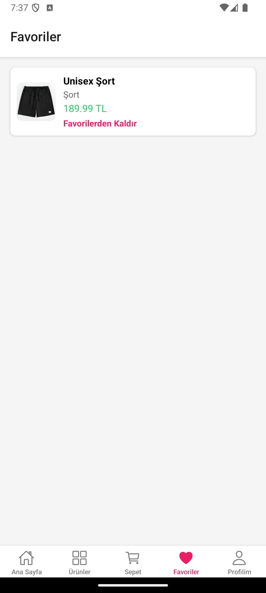
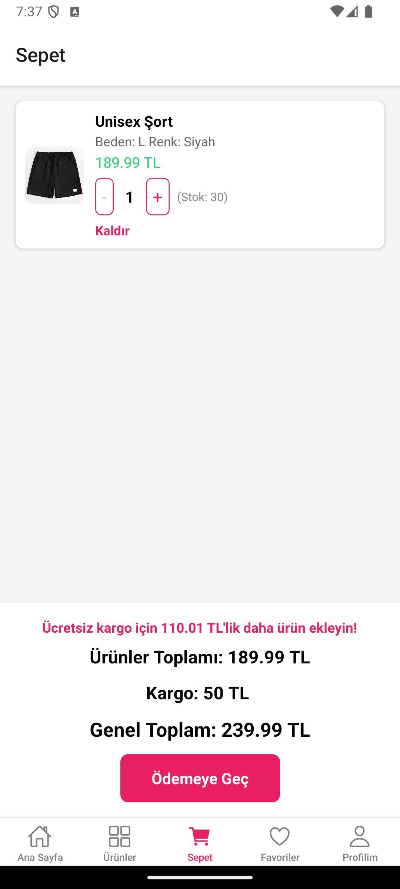

## Modanist

[](LICENSE)
[](https://firebase.google.com/products/firestore)

Simple and intuitive fashion shopping app built with React Native and Firebase Firestore. Modanist allows you to manage products—with options like name, description, price, category, size, color, and stock—directly in Firestore.

---

### 🚀 Features

* **Add & Manage Products**: Create, read, update, and delete products in Firestore.
* **Detailed Attributes**: Track product details such as size, color, category, and price.
* **Server Timestamps**: Automatically record creation and update times.
* **Modular Codebase**: Clean React Native & TypeScript structure.

---

### 📸 Screenshots

<p align="center">
  
  
  
</p>
<p align="center">
  
  
  
</p>

---

### ⚙️ Installation

1. **Clone the repository**
   ```bash
   git clone https://github.com/b3rknt/Modanist.git
   cd Modanist
   ```

2. **Install dependencies**
   ```bash
   npm install
   # or
   yarn install
   ```

3. **Configure Firebase**

   * Copy `.env.example` to `.env` and add your Firebase config values.

4. **Run the helper script** *(to seed products)*
   ```bash
   node addProducts.js
   ```

5. **Start the app**
   ```bash
   npm start
   # or
   expo start
   ```

---

### 🛠️ Usage

* Use the `addProducts.js` script to populate Firestore with initial products.
* Navigate through the app to view, add to cart, and manage product listings in real-time.

---

### 🤝 Contributing

Contributions are welcome! Please:

1. Fork the repository.
2. Create a new branch (`git checkout -b feature/my-feature`).
3. Commit your changes (`git commit -m 'Add new feature'`).
4. Push to the branch (`git push origin feature/my-feature`).
5. Open a Pull Request.

---

### 📄 License

This project is licensed under the MIT License. See [LICENSE](LICENSE) for details.

---

### 📬 Contact

For questions or suggestions, feel free to reach out:

* Email: [berkantsair@proton.me](mailto:berkantsair@proton.me)
* GitHub: [b3rknt](https://github.com/b3rknt)
